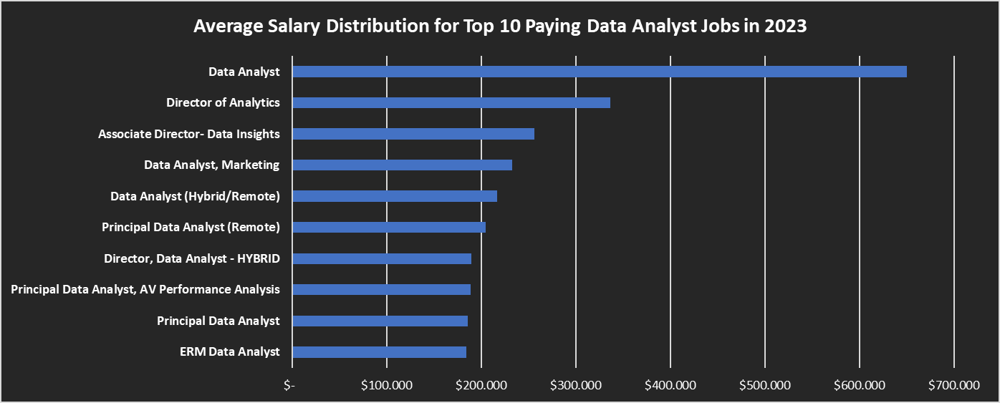

# Introduction
Dive into the data job market! focusing on data analyst roles, this project explore top-paying jobs, in-demands skills, and where high demand meets high salary in data analytics.

SQL queries? Check them out here: [project_sql folder](/project_sql/)

# Background
Driven by a quest to navigate the data analyst job market more effectively, this project was born from a desire to pin point top-paid and in demand skills, streamlining other work to find optimal jobs.

Data hails from [SQL Course](https://lukebarousse.com/sql). It's packed with insights on job titles, salaries, location, and essentials skills.

### The question I want to answer through my SQL queries were :

1. what are the top-paying data analyst jobs?
2. What skills are required for the top-paying Data Analyst jobs?
3. What are the most in-demand skills for data analysts?
4. Wich skill are associated with higher salaries?
5. What are the most optimal skills to learn ?

# Tools I Used 
For my deep dive into the data analyst job market, I harnessed the power of several key tools:

- **SQL:** The backbone of my analysis, allowing me to query the database an unearth critical insight.
- **PostgreSQL:** The choosen database management system, ideal handling the job posting data.
- **Visual Studio Code:** My go-to for database management and executing SQL queries.
- **Git & Github:** Essential for version control and sharing my SQL scripts and analysis, ensuring collaboration and project tracking.

# The Analysis
Each query for this project aimed at investigating specific aspects of the data analyst job market. Here how I approached each question:

### 1. Top Paying Data Analyst Jobs
To identify the highest-paying roles, I filtered data analyst positions by average yearly salary and location, focusing on remote jobs. This query highlights the high paying opportunities in the field.

```sql
SELECT
    job_id,
    job_title,
    job_location,
    job_schedule_type,
    salary_year_avg,
    job_posted_date,
    name AS company_name
FROM
    job_postings_fact
LEFT JOIN company_dim ON job_postings_fact.company_id = company_dim.company_id
WHERE 
    job_title_short = 'Data Analyst' AND 
    job_location = 'Anywhere' AND
    salary_year_avg IS NOT NULL
ORDER BY 
    salary_year_avg DESC
LIMIT 10
```
Here's the breakdown of the top data analyst jobs in 2023

- **Wide Salary Range:** Top 10 paying data analyst roles span from $184,000 to $650,000, indicating significant salary potential in the field
- **Diverse Employers:** Companies like SmartAsset, Meta, and T&T are amog those offering high salaries, showing a broad interests across different industries.
- **Job Tittle Variety:** There's a high diversity in job titles, from Data Analyst to Director of Analytics, reflecting varied roles and specializations within data analytics.

 
*Bar graph visualizing the salary for the top 10 salaries for data analysts; I use excel to make this graph and using data from my sql query results*

### 2. Skills for Top Paying Jobs
To understand what skills are required for the top-paying jobs, I joined the job postings with the skills data, providing insights into what employers value for high-compensation roles.
```sql
WITH top_paying_jobs AS (
    SELECT
        job_id,
        job_title,
        salary_year_avg,
        job_posted_date,
        name AS company_name
    FROM
    job_postings_fact
    LEFT JOIN company_dim ON job_postings_fact.company_id = company_dim.company_id
    WHERE 
    job_title_short = 'Data Analyst' AND 
    job_location = 'Anywhere' AND
    salary_year_avg IS NOT NULL
    ORDER BY 
    salary_year_avg DESC
    LIMIT 10
)

SELECT 
    top_paying_jobs.*,
    skills 
FROM top_paying_jobs
INNER JOIN skills_job_dim ON top_paying_jobs.job_id = skills_job_dim.job_id
INNER JOIN skills_dim ON skills_job_dim.skill_id = skills_dim.skill_id
ORDER BY salary_year_avg DESC
```
here's the breakdown of the most demanded skills for the top highest paying data analyst job in 2023:

- **SQL** is leading with a bold count of 8
- **Python** follows closely with a bold count of 7
- **Tableu** is also highly sought after, with a bold count of 6. Other skills like **R**, **Snowflake**, **Pandas**, and **Excel** show varying degrees of demand.

 
*Bar graph visualizing the count of skils for the top 10 paying job for data analysts; I use excel to make this graph and using data from my sql query results*

### 3. In-Demand skills for Data Analysts
This query helped identify the skills most frequently requested in job postings, directing focus to areas with high demand.
```sql
SELECT 
    skills,
    COUNT(skills_job_dim.job_id) AS demand_count
FROM 
    job_postings_fact
INNER JOIN skills_job_dim ON job_postings_fact.job_id = skills_job_dim.job_id
INNER JOIN skills_dim ON skills_job_dim.skill_id = skills_dim.skill_id
WHERE 
    job_title_short = 'Data Analyst'
GROUP BY 
    skills
ORDER BY 
    demand_count DESC
LIMIT 5
```
Here`s the breackdown of the most demanded skills for data analyst in 2023
- **SQL** and **Excel** remain fundamental, emphasizing the need for strong foundational skills in data processing and spreadsheet manipulation.
- **Programming** and **Visualization Tools** like **Python**, **Tableau**, and **Power BI** are essential, pointing towards the increasing importance of technical skill in data storytelling and decision support.

| Skills   | Demand Count |
|----------|-------------|
| SQL      | 92628       |
| Excel    | 67031       |
| Python   | 57326       |
| Tableau  | 46554       |
| Power BI | 39468       |

*Table of demand for the top 5 skills in data analyst job postings*

### 4. Skills Based on Salary
Exploring the average salaries associated with different skills revealed which skills are the highest paying.
```sql
SELECT 
    skills,
    ROUND (AVG(salary_year_avg),0) AS average_salary
FROM job_postings_fact
INNER JOIN skills_job_dim ON job_postings_fact.job_id = skills_job_dim.job_id
INNER JOIN skills_dim ON skills_job_dim.skill_id = skills_dim.skill_id
WHERE  
    job_title_short = 'Data Analyst'
    AND salary_year_avg IS NOT NULL 
    AND job_work_from_home = True
GROUP BY 
    skills
ORDER BY 
    average_salary DESC
LIMIT 25
```
Here's a breakdown of the results for top paying skills for Data Analysts:
- **HIgh Demand for Big Data & ML Skills:** Top salaries are commanded by analysts skilled in big data technologies (PySpark, Couchbase), machine learing tools (DataRobot, Jupyter), an Python libraries (Pandas,NumPy), reflecting the industri's high valuation of data processing and predictive modeling capabilities.
- **Software Development & Deployment Proficiency:** Knowledge in development and deployment tools (GitLab, Kubernetes, Aitflow) indicates a lucrative crossover beetwen data analysis and engineering, with premium on skills tha facilitate automation and efficient data pipeline management.
- **Cloud Computing Expertise:** Familiarity with cloud and data engineering tools (Elasticsearch, Darabricks, GCP) underscores the growing importance of cloud-based analytics environments, suggesting cloud proficiency significantly boosts earning potential in data analytics. 

| Skills         | Average Salary |
|----------------|----------------|
| pyspark        | 208172         |
| bitbucket      | 189155         |
| couchbase      | 160515         |
| watson         | 160515         |
| datarobot      | 155486         |
| gitlab         | 154500         |
| swift          | 153750         |
| jupyter        | 152777         |
| pandas         | 151821         |
| elasticsearch  | 145000         |

*Table of the average salaryy for the top 10 paying skills for data analysts*

### 5. Most Optimal Skills to Learn
Combining insights from demand and salary data, this query aimed to pinpoint skills that are both in high demand and have high salaries, offering a strategic focus for skill development.
```sql
SELECT
    skills_dim.skill_id,
    skills_dim.skills,
    COUNT(skills_job_dim.job_id) AS demand_count,
    Round(AVG(job_postings_fact.salary_year_avg),0) AS avg_salary
FROM job_postings_fact
INNER JOIN skills_job_dim ON job_postings_fact.job_id = skills_job_dim.job_id
INNER JOIN skills_dim ON skills_job_dim.skill_id = skills_dim.skill_id
WHERE  
    job_title_short = 'Data Analyst'
    AND salary_year_avg IS NOT NULL 
    AND job_work_from_home = True
GROUP BY 
    skills_dim.skill_id
HAVING 
    COUNT(skills_job_dim.job_id) > 10
ORDER BY
    avg_salary DESC,
    demand_count DESC
LIMIT 25;
```
| skill_id | Skills       | Demand Count | Avg Salary |
|----------|-------------|--------------|------------|
| 8        | go          | 27           | 115320     |
| 234      | confluence  | 11           | 114210     |
| 97       | hadoop      | 22           | 113193     |
| 80       | snowflake   | 37           | 112948     |
| 74       | azure       | 34           | 111225     |
| 77       | bigquery    | 13           | 109654     |
| 76       | aws         | 32           | 108317     |
| 4        | java        | 17           | 106906     |
| 194      | ssis        | 12           | 106683     |
| 233      | jira        | 20           | 104918     |

*Table of the most optimal skills for data analyst sorted by salary*

Here's a breakdown of the most optimal skill for Data Analysts in 2023:
- **High-Demand Programing Languages:** Python and R stand out for their high demand, with demand counts of 236 and 148 respectively. Despite their high demand, their average salaries are around $101,397 for Python and $100,499 for R, indicating that proficiency in these languages is highly valued but also widely available.
- **Cloud Tools and Technologies:** Skill in specialized technologies such as Snowflake, Azure, AWS, and BigQuery show significant demand with relatively high average salaries, pointing toward the growing importance of cloud performs and big data technologies in data analysis.
- **Business Intelligence and Visualization Tools:** Tableau and Looker, with demand counts of 230 and 49 respectively, and average salaries around $99,288 and $103,795, highlight the critical role of data visualization and business intelligence in deriving actionable insights from data.
- **Database Technologies:** The demand for skills in traditional and NoSQL databases (Oracle,SQL Server,NoSQL) with average salaries ranging from $97,786 to $104,534, reflects the enduring need for data storage, retrieval, and management expertise.

# What I Learned
Throughout this adventure, I've turbocharged my SQL toolkit with some serious firepower:

- **Complex Query Crafting:** Mastered the art of advanced SQL, merging tables like a pro and wielding WITH clauses for ninja-level temp tables maneuvers.
- **Data Aggregation:** Got cozy with GROUP BY and turned aggregate functions like COUNT() and AVG() into my data-summarizing sidekicks.
- **Analytical Wizardly:** Leveled up my real-world puzzle-solving skills, turning questions into actionable, insightful SQL queries.

# Conclusions
Through this deep dive into the data analyst job market, several key insights emerged that can guide job seekers and professionals looking to maximize their career potential.

1. High Salary Potential in Data Analytics
The top-paying data analyst roles offer significant salary potential, ranging from $184,000 to $650,000 per year.
These salaries vary based on job title, industry, and expertise level, with positions like Director of Analytics commanding the highest pay.
2. Key Employers and Industry Trends
High salaries are offered by diverse companies, including SmartAsset, Meta, and AT&T, indicating that data analysts are in demand across various industries, such as tech, finance, and telecommunications.
There is a broad range of job titles, from Data Analyst to Principal Data Analyst, reflecting different specializations and leadership roles in the field.
3. The Most In-Demand Skills for Data Analysts
SQL and Excel remain fundamental skills, showing the importance of data processing and management.
Programming skills like Python and R are highly sought after, particularly for their applications in data analytics, automation, and machine learning.
Business intelligence and visualization tools, such as Tableau, Power BI, and Looker, are essential for translating data into actionable insights.
4. Skills That Lead to Higher Salaries
Big Data & Machine Learning Skills (e.g., PySpark, Couchbase, DataRobot, Pandas, NumPy) lead to higher salaries, reflecting the growing industry focus on predictive analytics.
Software Development & Deployment Skills (e.g., GitLab, Kubernetes, Airflow) bridge the gap between data analysis and engineering, making professionals with these skills more valuable.
Cloud Computing Expertise (e.g., Elasticsearch, Databricks, GCP, AWS, Snowflake) is becoming increasingly important, as more companies migrate to cloud-based data infrastructures.
5. The Most Optimal Skills to Learn
Learning Python, SQL, and R is a great starting point, as they have high demand and strong salary potential.
Cloud and database technologies, including BigQuery, Snowflake, and NoSQL, offer a competitive edge in the job market.
Business intelligence tools like Tableau and Looker remain crucial for storytelling and decision-making in data analytics.

**Final Thought**
This analysis highlights the exciting opportunities in data analytics, showing that high salaries, in-demand skills, and career growth go hand in hand. By mastering the right tools and technologies, professionals can position themselves for success in this ever-evolving industry.
